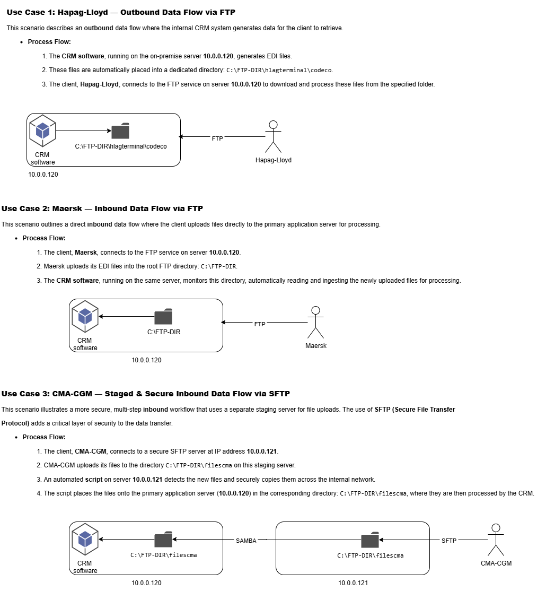

# FileFlow-Orchestrator: An Enterprise FTP/SFTP Gateway

**FileFlow-Orchestrator** is a robust, production-ready file transfer gateway designed for complex enterprise environments. Developed for a real-world client, this project showcases advanced skills in DevOps, automation, and secure systems architecture using Docker Compose, Python (Flask), and modern Linux administration practices.

It provides a complete, multi-container solution for hosting a secure and flexible file transfer gateway. It is designed to handle complex, real-world business workflows by offering both **FTP** and **SFTP** services, along with an automated file-forwarding system and a powerful web-based administrative dashboard. The entire environment is orchestrated via a single `docker-compose.yml` file, making it easy to deploy, manage, and scale.



##  Project Highlights

-   **Multi-Protocol Gateway:** Seamlessly supports both legacy **FTP** and secure **SFTP**, enabling flexible integration with diverse business partners and systems.
    
-   **Intelligent Workflow Automation:** Features a custom, event-driven file-forwarder that monitors uploads and automatically routes files to external destinations based on user-defined rules, ensuring efficient and reliable workflow automation.
    
-   **Centralized Web-Based Administration:** Includes a modern Flask-based dashboard for real-time monitoring, comprehensive user management, live log inspection, and service control without requiring SSH access.
    
-   **Enterprise-Grade Security:** Implements a multi-layered security model, including chrooted user environments to prevent unauthorized file system access, and strict directory permissions for maximum data protection.
    
-   **Infrastructure as Code (IaC):** The entire infrastructure is defined and managed via Docker Compose, ensuring 100% reproducible, scalable, and easily deployable environments.
    
-   **Self-Healing & Auditable:** Designed for high availability with automated service restarts, health monitoring, and detailed logging for all transfer activities, simplifying audits and troubleshooting.
    

##  Architecture Overview

The system is designed with a decoupled, microservices-based architecture, where each core function is isolated in its own container. A shared Docker volume acts as the central storage hub, allowing seamless data exchange between services while maintaining a single source of truth for all files.

```
+-------------------+      +-------------------+      +-------------------+
|    FTP Server     | <--->|   Shared Storage  | <--->|    SFTP Server    |
| (vsftpd, Docker)  |      |   (Docker Volume) |      | (emberstack/sftp) |
+-------------------+      +-------------------+      +-------------------+
         |                          ^                          |
         |                          |                          |
         +--------------------------+--------------------------+
                                    |
                                    v
                 +-------------------------------------+
                 |      File Forwarder Service         |
                 | (Monitors Storage, Forwards Files)  |
                 +-------------------------------------+
                                    ^
                                    | (Manages & Monitors)
                                    v
                 +-------------------------------------+
                 |      Web Admin Dashboard            |
                 |        (Flask, Docker)              |
                 +-------------------------------------+

```

##  Key Features

-   **Dynamic User Management:** Add, remove, and update FTP/SFTP users and their permissions directly from the web dashboard, with changes applied instantly via automated service restarts.
    
-   **Real-Time Service Monitoring:** Instantly view the health and status (`running`, `exited`, `restarting`) of all containers and services.
    
-   **Comprehensive Log Access:** Browse both recent and full, unabridged logs for any service, enabling rapid troubleshooting and detailed auditing.
    
-   **Service Control Panel:** Securely restart, stop, or start individual services (FTP, SFTP, Forwarder) directly from the web UI.
    
-   **Automated Directory Initialization:** A dedicated container ensures all required folder structures and permissions are correctly configured at startup, preventing common permission-related errors.
    

##  Technologies Used

-   **Containerization & Orchestration**: **Docker** & **Docker Compose**
    
-   **Web Backend & API**: **Python** with **Flask**
    
-   **FTP Service**: Custom Debian Image with **vsftpd**
    
-   **SFTP Service**: **emberstack/sftp** with JSON-based configuration
    
-   **Automation & Scripting**: **Bash**, **Alpine Linux**, `inotify-tools`, `lftp`
    

##  How to Run

1.  **Clone the repository:**
    
    ```
    git clone https://github.com/marcolucc/FileFlow-FTP-SFTP-Orchestrator.git
    cd FileFlow-Orchestrator
    
    ```
    
2.  **Configure the Environment:** Update environment variables and credentials in `docker-compose.yml` and the relevant configuration files (`.json`, `.txt`) as needed.
    
3.  **Build and Start Services:**
    
    ```
    docker-compose up --build -d
    
    ```
    
4.  **Access the Web Dashboard:** Open `http://localhost:82` in your browser.
    

##  Testing

A comprehensive test script (`test.sh`) is included to validate all major use cases, ensuring the reliability and correctness of the system's core functionalities:

-   FTP & SFTP user authentication and chroot jail validation.
    
-   File upload and download permissions.
    
-   Automated file forwarding logic and log monitoring.
    
